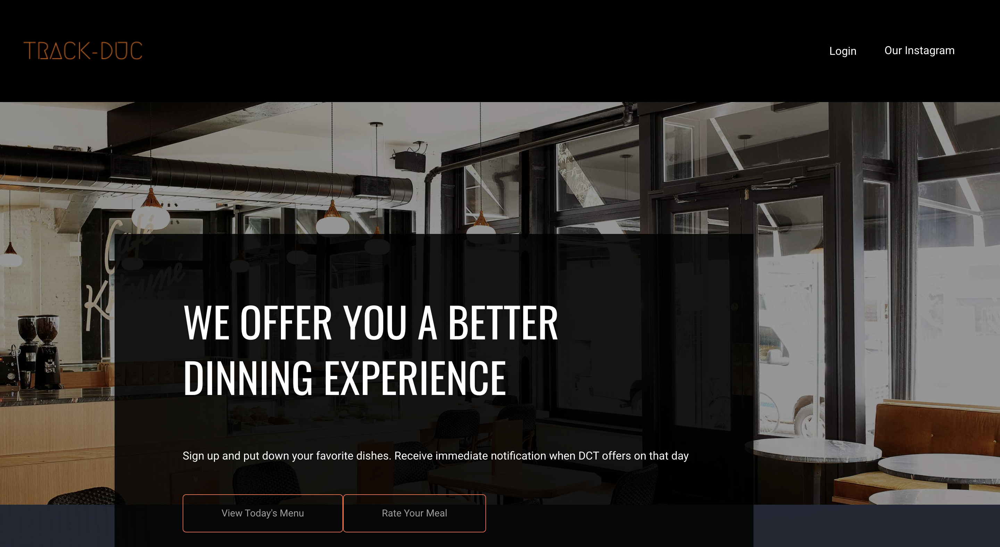

# EmoryHackathon2020 - TrackDUC

This project is intended to give a communication platform to Emory food providers to make the dining experience better
for Emory Students, and is built during Emory Hackathon 2020 within 10 hours.

## Implementation

### Backend
The backend is implemented by SpringBoot with Data Server and Database. 
The Data Server provides RESTful API as an interface to communicate with frontend clients and consists of three layers:
* Controller - Receives requests and sends responses from and to front end clients
* Service - Receives data from Controller layer and perform business logic
* Domain model and Persistance - Manages entity models and store data in database

### Frontend
The front end is implemented by React.

## Features
1. Collects data from students food preferences
2. Informs students when their preferred food is being served
3. Shows the menu and nutrition information

## Team
* Matthew Chau - Full Stack Developer, Emory 2021 Math & CS and Music Major
* Mark Yang - (Frontend?)
* Julian Zhao - (Backend?)
* Oliver Wang - (Backend?)

